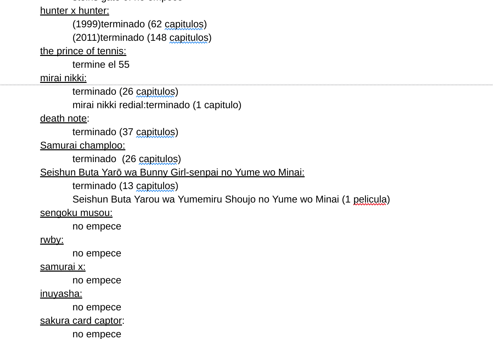
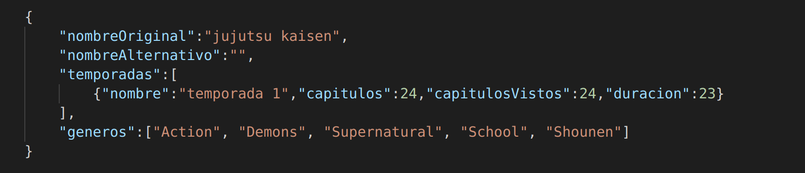

# Trabajo práctico: Datos personales
## Idea
Partiendo de una lista de animes que tengo en la cual anoto, tanto animes que me llamaron la atención, como animes que estoy viendo, analizar ciertos datos de la misma.

## Datos
### Doc
El documento en cuestión es de la siguiente manera:

Este es un documento en el que desde 2013 llevó cuenta de todos los animes que vi o que me interesaron de alguna forma.

El mismo quiero pasarlo a JSON para poder trabajarlo más fácilmente y luego agregarle datos referidos al género del anime y duración de sus capítulos. Esta información la voy a extraer mayormente de [My anime list (MAL)](https://myanimelist.net/)

### JSON
El JSON quedaría como una lista con entradas de esta forma:

y contendría alrededor de 135 entradas.
Una vez tenga este JSON es fácil manipularlo usando Javascript para obtenerlo en distintos formatos o extraer distintos datos.

## Ideas para la visualización de los datos
- Generos ordenados por horas que vi, por horas totales en mi lista, por cantidad de series que vi y por cantidad de series que hay en mi lista
- Cuántas horas de anime vi y compararlas con otras cosas que tomen el mismo tiempo, por ejemplo, porcentaje de una carrera, viajes a mar del plata, cantidad de libros que se podrían leer, etc.
- Cuántas horas de anime vi VS. Cuantas horas totales hay en mi lista
